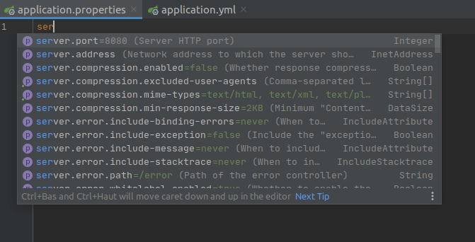
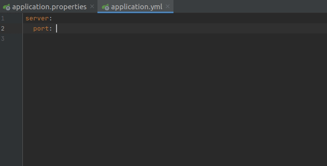
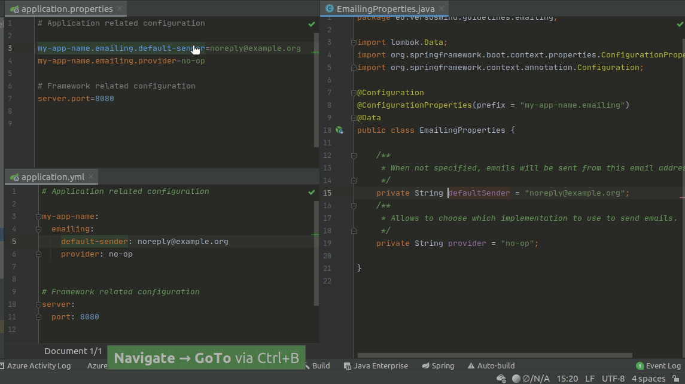

# Guidelines : Spring configuration

## Complétion automatique et documentation `application.properties|yml`
 
Complétion automatique dans l'ide

pom.xml
```xml
        <dependency>
            <groupId>org.springframework.boot</groupId>
            <artifactId>spring-boot-configuration-processor</artifactId>
            <optional>true</optional>
        </dependency>
```

Auto-completion sur application.propeties


Auto-completion sur application.ymlpropeties


### Activer la complétion automatique pour vos propres configurations

Vous aurez peut-être remarqué que cette fonctionalité fonctionne bien avec les properties de vos dépendances mais pas 
les votres!

Pour ce faire, il vous faut activer l'annotation processor dans votre IDE.
Pour éviter de modifier la configuration de l'IDE, je propose de le faire via Maven.
Ainsi, les prochains développeurs sur votre projet n'auront pas à configurer leur IDE à la main.

Activer l'annotation processor dans le plugin `maven-compiler-plugin`.
- `lombok`
- `spring-boot-configuration-processor`

pom.xml
```xml
    <build>
        <plugins>
            <plugin>
                <groupId>org.springframework.boot</groupId>
                <artifactId>spring-boot-maven-plugin</artifactId>
                <configuration>
                    <excludes>
                        <exclude>
                            <groupId>org.projectlombok</groupId>
                            <artifactId>lombok</artifactId>
                        </exclude>
                    </excludes>
                </configuration>
            </plugin>
            <plugin>
                <groupId>org.apache.maven.plugins</groupId>
                <artifactId>maven-compiler-plugin</artifactId>
                <version>3.8.1</version>
                <configuration>
                    <annotationProcessorPaths>
                        <path>
                            <groupId>org.projectlombok</groupId>
                            <artifactId>lombok</artifactId>
                            <version>${lombok.version}</version>
                        </path>
                        <path>
                            <groupId>org.springframework.boot</groupId>
                            <artifactId>spring-boot-configuration-processor</artifactId>
                            <version>2.4.2</version>
                        </path>
                    </annotationProcessorPaths>
                </configuration>
            </plugin>
        </plugins>
    </build>
```

Modifier la classe de properties configuration pour ajouter un nouvel attibut (ex. `private boolean enabled=false`)

Re-build le projet (c'est un moindre mal) pour que la complétion soit mise à jour depuis `application.properties` ou `application.yml`.



## Conventions

### Choisir un style de nommage et s'y tenir

Les configurations spring supportend plusieurs façon de nommer des variables:
- `snake-case`
- `camelCase`
- `PascalCase`
- `notation.par.points`
- `ENVIRONMENT_VAR_STYLE`

Ces conventions peuvent être combinées

```properties
my.awesome.configuration="hello!"
my-awesome-configuration="hello!"
my.awesomeConfiguration="hello!"
```

Personnellement, je combine la `notation.par.points` et la notation `snake-case` car je la trouve plus lisible.
- `snake-case` : pour les mots composés
- `notation.par.points` pour séparer les concepts

Cela me permet de grouper de façon cohérente mes variables et la traduction dans les classes annotées `@ConfigurationProperties` va de soi.

application.properties
```properties
my-app-name.emailing.default-sender=noreply@example.org
```

application.yml
```yml
# Application related configuration
my-app-name:
  emailing:
    default-sender: noreply@example.org
```

Spring fait automatiquement la conversion dans les classes de configuration
EmailingProperties.java
```java
@Configuration
@ConfigurationProperties(prefix = "my-app-name.emailing")
@Data
public class EmailingProperties {
    private String defaultSender = "noreply@example.org";
}

```

### Préfixer tout ce qui concerne l'application elle-meme.

Pourquoi?
- Permet de différencier que qui relève des modules de l'application du reste (framework, JVM options ...)
- Permet de se poser la question du nommage des configurations et peut amener à penser en terme de modules indépendants.
- Bon prérequis pour des feature toggle
- Facilite la maintenance et l'exploitation de la configuration (notamment par variables d'environnement)
- Ce type de nommage permet de tirer profit des configurations imbriquées (`@NestedConfiguration`)
 
Ex.
```properties
# Application related configuration
my-app-name.emailing.enabled=true
my-app-name.emailing.default-sender=noreply@example.org
my-app-name.emailing.provider=some-vendor
my-app-name.emailing.some-vendor.api-key=truc

# Framework related configuration
server.port=8080
```

L'intéret est d'autant plus visible dans la configuration yml

```yml
# Application related configuration
my-app-name:
  emailing:
    enabled: true
    default-sender: noreply@example.org
    provider: some-vendor
    some-vendor:
      api-key: truc

# Framework related configuration
server:
  port: 8080
```

Lorsqu'on configure l'application via les variables d'environnement (ex. dans le portail Azure, qui les trie par ordre alphabétique).
On repère tout de suite ce qui concerne la configuration de l'application de la configuration du framework ou de la JVM

```
MY_APP_NAME_EMAILING_DEFAULT_SENDER="noreply@example.org"
MY_APP_NAME_EMAILING_ENABLED="true"
MY_APP_NAME_EMAILING_PROVIDER="some-vendor"
MY_APP_NAME_EMAILING_SOME_VENDOR_API_KEY="truc"
SERVER_PORT="8080"
```

## Grouper les configurations par module

TODO

- plus facile à tester
- permet de changer les implémentation par configuration (ex. email provider, on ne veut pas envoyer des vrais emails en local)
- Switch toggle
- Activation / Desactivation d'un module
- Eviter le couplage par design : réduire au maximum la visibilité des classes / constructeurs / méthodes

Ne pas utiliser `@Component`, `@Service`, ... préférer l'initialisation de vos beans dans des classes de configuration.
- Car meilleure maitrise de vos switch
- Meilleur contrôle en cas de mauvaise configuration (vous pouvez choisir vos propres messages d'erreur)
- Vous force à éviter de dépendre de spring pour exécuter vos tests
- Vous permet de mieux sectionner votre application par use case

Injecter par constructeur.