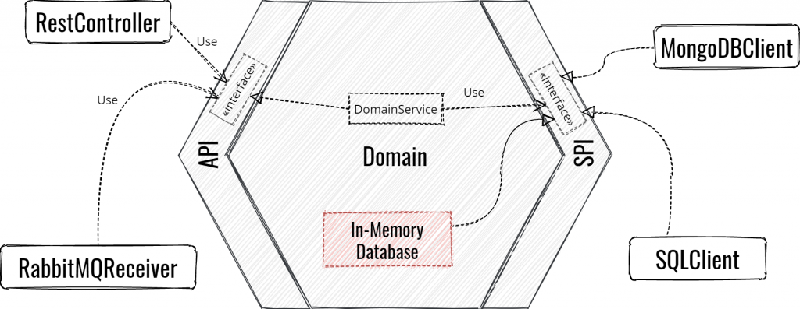

## Domaine métier

> Pour permettre à l’extérieur d’interagir avec le domaine, l’hexagone fournit des interfaces métier divisées en deux catégories :
> 
> - **L’API** rassemble toutes les interfaces pour tout ce qui a besoin d’interroger le domaine. Ces interfaces sont implémentées par l’hexagone.
> - **La SPI** (Service Provider Interface) rassemble toutes les interfaces requises par le domaine pour récupérer des informations auprès de tiers. Ces interfaces sont définies dans l’hexagone et implémentée par le côté droit de l’infrastructure. Nous verrons que dans certaines circonstances, l’hexagone peut également implémenter la SPI.
> 
> 
> Source : https://beyondxscratch.com/fr/2018/09/11/architecture-hexagonale-le-guide-pratique-pour-une-clean-architecture/

Il y a deux faits importants ici :

- **L’API et la SPI font partie de l’hexagone.**
- L’API et la SPI ne manipulent que les objets de domaine de l’hexagone. Ceci assure en effet l’isolement de celui-ci.

### Annotations

- @`_.domain.api.@DomainService` : 
- @`_.domain.stubs.@Stub` : 

## Tests

- Factories : TODO
- @`_.domain.Random` : TODO
- `test/resources/META-INF/services/org.junit.jupiter.api.extension.Extension` : TODO
- Live documentation & test contracts from test with Spring Rest Doc
    - https://youtu.be/v--zkIEciq4?t=1335
    - https://gitlab.com/crafts-records/talkadvisor/talkadvisor-back

## Ressources connexes

- [BDX I/O 2019 - Architecture Hexagonale Level 2: Comment bien écrire ses tests - Julien Topçu et Jordan Nourry](https://www.youtube.com/watch?v=v--zkIEciq4)