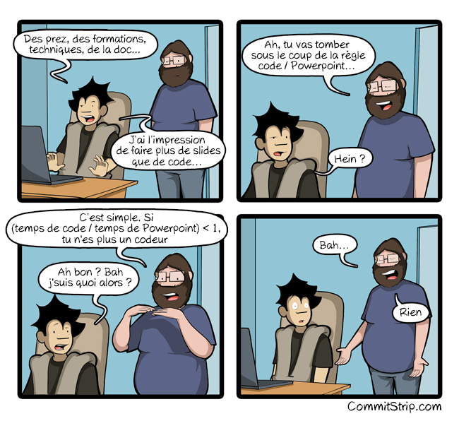

include::who_i_am.adoc[]

[.columns]
== About this presentation

[.column]
--
* Présentation et sources en ligne
--

[.column]
--

--

[.refs]
--
* link:https://u.baldir.fr/at-2021-ld[]
* Lien vers cette présentation
--

=== Presentation as code

[.refs]
--
* https://www.commitstrip.com[Commit strip]
* https://www.commitstrip.com/fr/2018/12/07/code-vs-powerpoint[Code vs Powerpoint] - 07/12/2018
--

=== Content

. What is documentation?
. The problem with traditional documentation
. Do you need documentation?
. Knowledge is already there
. New ways to write documentation