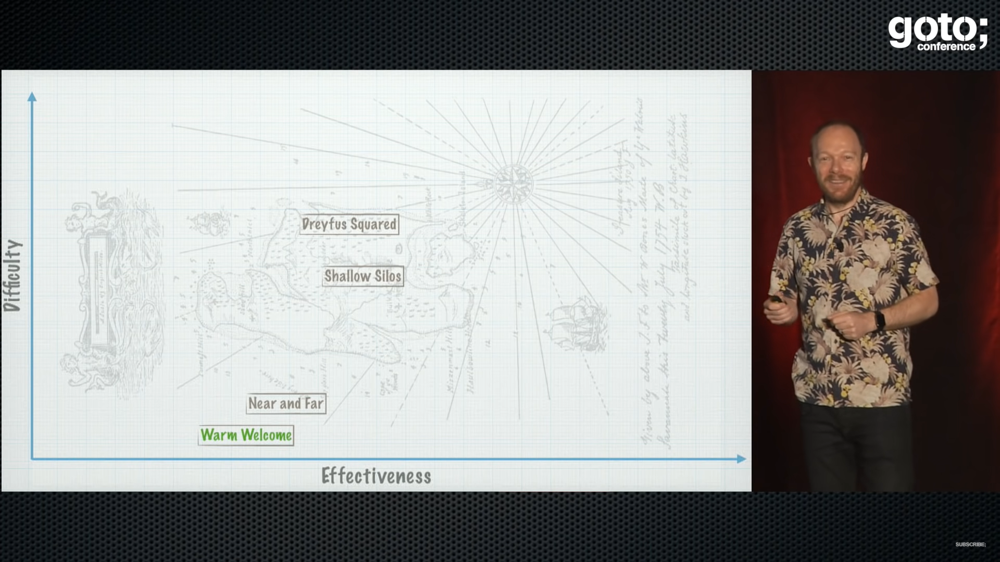

== Living onboarding

=== Wiki

[.refs]
--
https://www.youtube.com/watch?v=lvs7VEsQzKY&t=1620s[Patterns of Effective Teams • Dan North • GOTO 2017] 27m00s - 30m30s
--

[.notes]
--
* Warm welcome : Dan north
    * Good first impression
    * Wiki page "Hi Dan, hare are some thing you may want to do on your first day"
    * Find out who's joining next and change the name at the top
    * https://www.youtube.com/watch?v=lvs7VEsQzKY&t=1620s[Patterns of Effective Teams • Dan North • GOTO 2017] 27m00s - 30m30s
--

=== Code Driven Guided tour

* Git Good first Issue
* CodeTour
    * Augmented CodeTour
* With Asciidoc include preprocessor directive
* With REST client + hypermedia
    * see https://www.youtube.com/watch?v=7qqzqse1hgc[REST next level : Ecrire des APIs web orientées métier (Julien Topçu)]

=== GUI Driven

* With High level automated GUI tests

=== Collaboration driven

* Live my life (immersion with/as business)
* pair programming
* mob programming