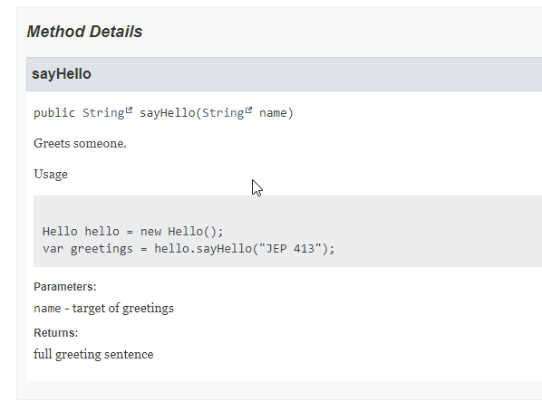

=== Java 18 Javadoc Code Snippets

https://openjdk.java.net/jeps/413:[JEP 413 : Code Snippets in Java API Documentation]

[%step]
- ⭐⭐⭐ Reliable
- ⭐⭐⭐ Low-Effort
- ⭐⭐⭐ Collaborative
- ⭐⭐⭐ Insightful

- ⭐⭐⭐ Refactor-Friendly
- ⭐⭐⭐ Stable
- ⭐⭐⭐ Automated
- ⭐⭐⭐ Insightful
- Internal / External
- Single sourced / reconciliation mechanism
- Audience

=== Code de prod : tag @snippet

[.medium]
[source,java]
----
include::../examples/executable-javadoc-code-snippets/src/main/java/fr/baldir/samples/hello/Hello.java[]
----

=== Tests

[.small]
[source,java,class=.small]
----
include::../examples/executable-javadoc-code-snippets/src/test/java/snippets/SnippetTest.java[]
----

=== Résultat généré

[.columns]
=== Qualités

[.column]
--
* Internal documentation
* in-situ
* machine-readable
--

[.column]
--
Attributes

* refactor-friendly
* automated documentation
* low effort
--

=== Resources

https://www.morling.dev/blog/executable-javadoc-code-snippets/
