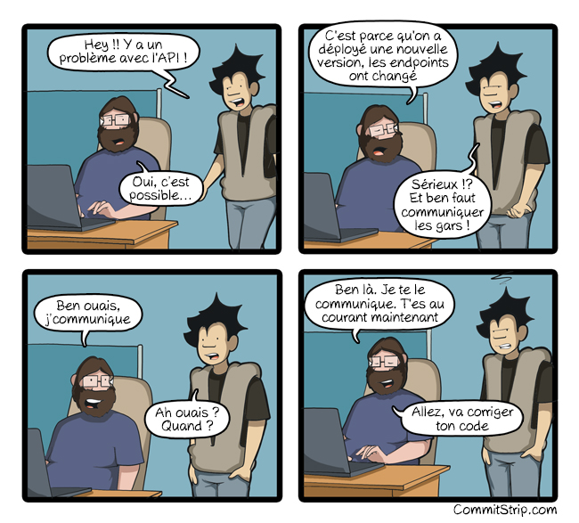
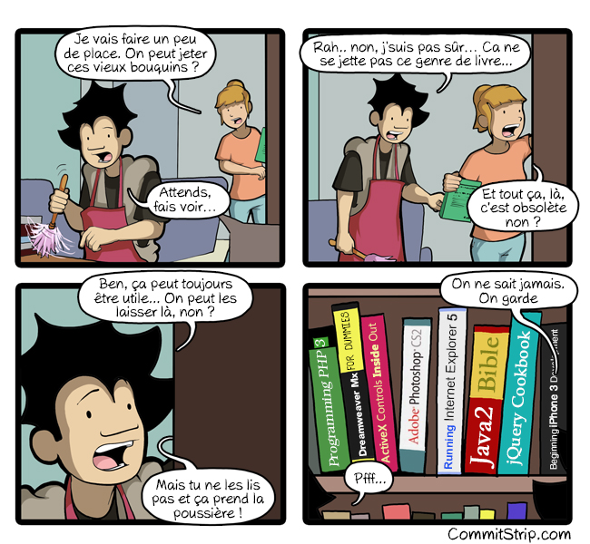
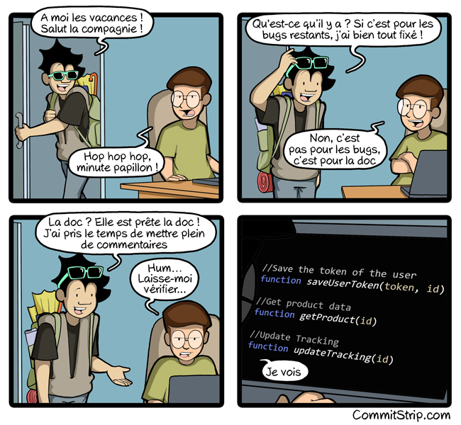
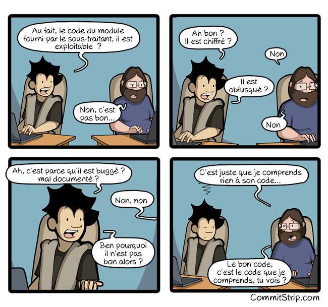

[background-color="#053246"]
== Documentation Smells

[quote,Gojko Adzic,Specification by Example: How Successful Teams Deliver the Right Software]
Like cheap wine, paper documentation ages rapidly and leaves you with bad headache.

[background-color="#053246"]
=== Y a pas de documentation

image:assets/commit_strip_no_documentation.png[alt=Extrait de du webcomic Commit Strip "Y a pas de documentation".
Développeur A demande à développeur B :
- A :  Hey, on m'a assigné des bugs à corriger sur ton dernier projet mais j'ai l'impression qu'il n'y a pas de documentation?
- B : Hein? Bien sûr qu'il y a de la doc. Il y a des infos dans des readme et des éléments sur le Jira. Ou alors c'est dans le trello... En plus, on a mis des infos sur des Google Docs dans un dossier partagé, regarde si t'as les droits. Même si c'est pas à jour c'est utile. Et, au pire, il y a plein de commentaires contextuels dans le code...
- A (en sortant de la pièce) : Bref, c'est bien ce que je disais... y a pas de doc, width=500]

[.refs]
--
* https://www.commitstrip.com[Commit strip]
* https://www.commitstrip.com/fr/2021/11/10/no-documentation[Y a pas de documentation] - 10/11/2021
--

[background-color="#053246"]
=== Anti-patterns

[%step]
* Different artifacts
* Redudant knowledge
* Out of date
* No confidence
* Separate activities
* Manual transcription
* Information graveyard

[background-color="#053246"]
=== It's about communication

[.refs]
--
* https://www.commitstrip.com[Commit strip]
* https://www.commitstrip.com/fr/2019/04/10/new-api-version[Nouvelle version de l’API] - 10/04/2019
--

[background-color="#053246"]
=== Anti-patterns

[%step]
* Not appropriate medium
* Not stable contract

[background-color="#053246"]
=== Static documentation 1/2

[.refs]
--
* https://www.commitstrip.com[Commit strip]
* https://www.commitstrip.com/fr/2017/01/23/coders-bookshelf[Bibliothèque de codeur] - 23/01/2017
--

[background-color="#053246"]
=== Static documentation 2/2

[.refs]
--
* yellow pages - Katie - 2010 - CC BY 2.0
* https://www.flickr.com/photos/allergictowork/26387486391
--

[background-color="#053246"]
=== Anti-patterns

[%step]
* Static medium for dynamic knowledge

[background-color="#053246"]
=== Documentation before vacation

[.refs]
--
* https://www.commitstrip.com[Commit strip]
* https://www.commitstrip.com/fr/2016/07/27/documentation-just-before-vacation[La documentation avant les vacances] - 27/07/2016
--

[background-color="#053246"]
=== Anti-patterns

[%step]
* Redundant knowledge
* Brain Dump
* Not refactoring Friendly

[background-color="#053246"]
=== Good code

[.refs]
--
* https://www.commitstrip.com[Commit strip]
* https://www.commitstrip.com/fr/2016/06/07/good-code[Le bon code] - 07/06/2016
--

[background-color="#053246"]
=== A quote

[quote,Martin Fowler,"Refactoring: Improving the Design of Existing Code, 1999"]
Any fool can write code that a computer can understand. Good programmers write code that humans can understand.

[.refs]
--
https://en.wikiquote.org/wiki/Martin_Fowler
--

[background-color="#053246"]
=== Anti-patterns

WARNING: Religious war material!

[%step]
* Self-documented code should be meanigful
* Comments may augment code
* We read

[.notes]
--
* Additional resources
** Clean code
** Felienne The Programmer's Brain
** https://devblogs.microsoft.com/oldnewthing/20070406-00/?p=27343
--

[background-color="#053246"]
=== Code sample 1

[.notes]
--
* Flags arguments
** When we read in IDE it's OK
** When we read in Pull Request cannot understand
--

[background-color="#053246"]
=== Code sample 2

[.notes]
--

--