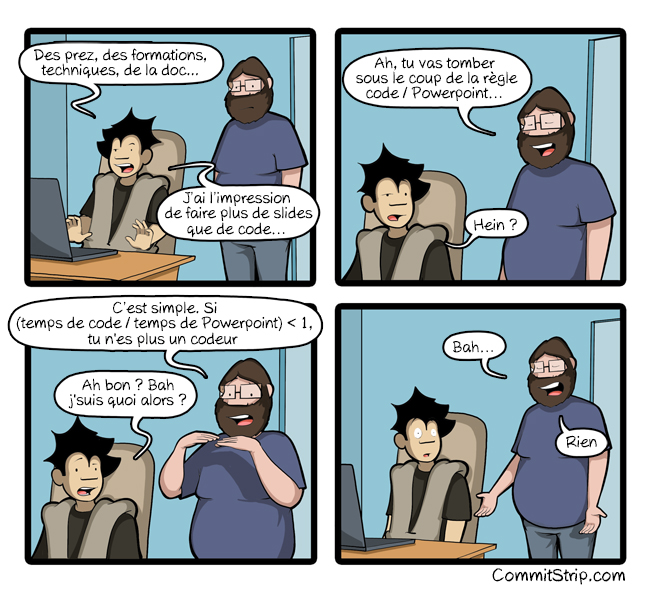

[background-color="#1d0546"]
== Presentation as code

[.refs]
--
* https://www.commitstrip.com[Commit strip]
* https://www.commitstrip.com/fr/2018/12/07/code-vs-powerpoint[Code vs Powerpoint] - 07/12/2018
--

[background-color="#1d0546"]
== Presentation as code

* Included code snippets are real sources
* AsciiDoctor
* RevealJs

[source,asciidoc]
----
include::examples/python_doctest/sum.py
----

[.bottom]
Downloadable sample: link:examples/python_doctest/sum.py[examples/python_doctest/sum.py]