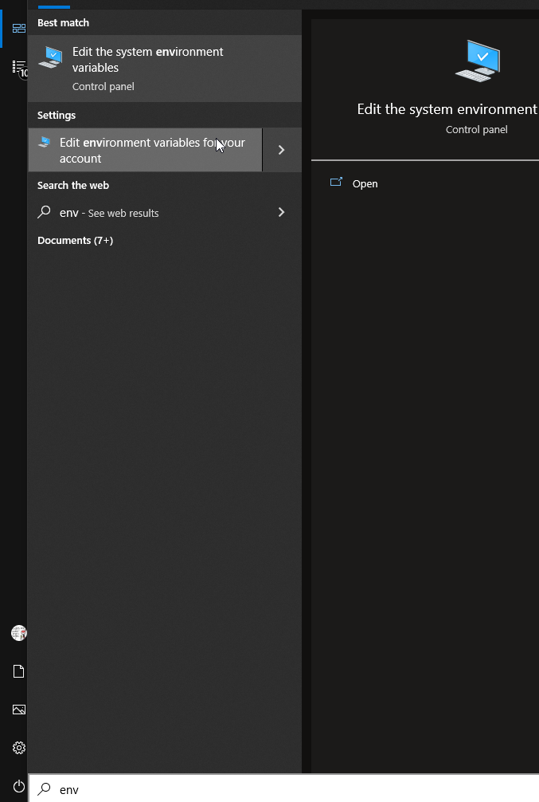
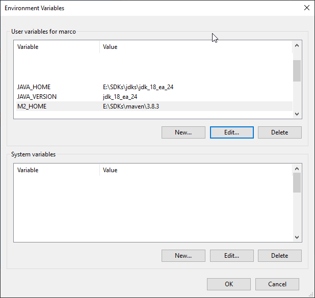
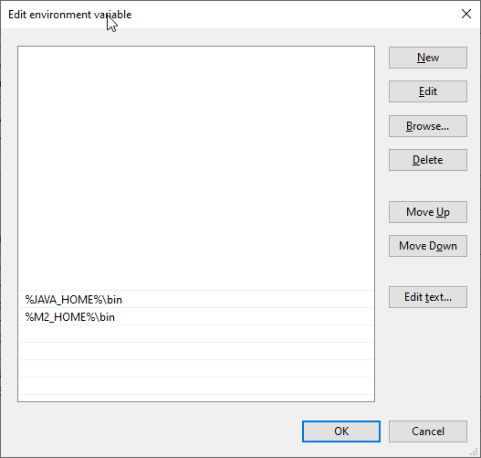

# JEP 413: Code Snippets in Java API Documentation
To be released in Java 18 [JEP 413](https://openjdk.java.net/jeps/413) will allow to reference code snippets from Javadoc.
This way, documentation can evolves when the code snippets are changed.

Code snippets may be imported from test sources ([see this blogpost](https://www.morling.dev/blog/executable-javadoc-code-snippets/)).
Following this practice, test will be able to have both testability and documentation responsibilities enforced together.

**Warning** : for now (2021-11-19) java 18 is still experimental and the `@snippet` tag is not supported in IDEs.

## Generated result


You can see by yourself the generation result in the folder [docs/apidocs](docs/apidocs).

[Hello.html#sayHello(java.lang.String)](docs/apidocs/fr/baldir/samples/hello/Hello.html#sayHello(java.lang.String))

## Build

Requisites : Maven & Jdk 18 (see below)

Build maven build

```bash
mvn clean install
```
The documentation should be output in `docs/apidocs`

## Install experimental JDK 18

### (Recommended) On linux or Windows with WSL

I recommend using WSL if you are using windows because SDKMAN makes it really easy to install, switch and remove jdks and maven.

- install SDKMAN : https://sdkman.io/install
- install java 18 eap : `sdk install java 18.ea.24-open` (say no to set it as default jdk)
- use java 18 eap : `sdk use java 18.ea.24-open`
- install maven : `sdk install maven`

## Build on Windows

- download jdk 18 : https://jdk.java.net/18/
- download Maven and uncompress : https://maven.apache.org/download.cgi#files

For this example both are unzip in `E:\SDKs\`.
You can see I have multiple jdks (`jdk_18_ea_24`,`temurin-17.0.1` )

```
E:\SDKs\
    jdks\
        jdk_18_ea_24\
            bin
            conf
            ...
        temurin-17.0.1\
            bin
            conf
            ...
    maven\
        3.8.3\
        bin
        boot
        ...
```

Set environment variables.

You can set User's env variables (recommended if you are not administrator or if you share your computer)
- Open Start menu or type the start key on your keyboard
  - Start to type "env"
    
- Add environment variables
  
  - `"JAVA_HOME"` : `"path/to/jdks/%JAVA_VERSION%"`
  - `"JAVA_VERSION"` : name to the root folder of your JDK (in my case `"temurin-17.0.1"` for the stable or `"jdk_18_ea_24"` for the experimental)
  - `"M2_HOME"` : path to the root folder of maven (in my case `"E:\SDKs\maven\3.8.3"`)
- Edit the `"PATH"` variable and add 2 entries
  
  - `"%JAVA_HOME%\bin"`
  - `"%M2_HOME%\bin"`

I recommend to set `"JAVA_VERSION"` to a stable version because you don't want your other java dependent applications to run on an experimental version of Java. We will switch to experimental jdk 18 (`"jdk_18_ea_24"`) only when needed, and then switch back to the stable one (in my case `"temurin-17.0.1"`).

```pwsh
# Display current java version
> $env:JAVA_VERSION
jdk_18_ea_24
# Verify version
> java -version
openjdk version "18-ea" 2022-03-15
OpenJDK Runtime Environment (build 18-ea+24-1608)
OpenJDK 64-Bit Server VM (build 18-ea+24-1608, mixed mode, sharing)
# Verify maven installation
> mvn -version
Apache Maven 3.8.3 (ff8e977a158738155dc465c6a97ffaf31982d739)
Maven home: E:\SDKs\maven\3.8.3
Java version: 18-ea, vendor: Oracle Corporation, runtime: E:\SDKs\jdks\jdk_18_ea_24
Default locale: en_US, platform encoding: UTF-8
OS name: "windows 10", version: "10.0", arch: "amd64", family: "windows"
```

**Don't forget to set back `"JAVA_VERSION"` to your stable jdk after you are done with the experiment.**