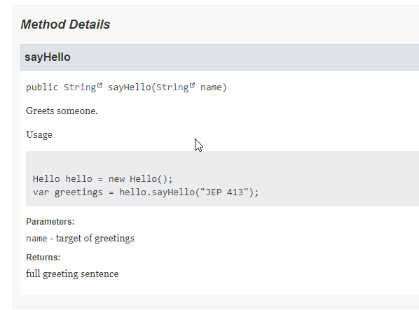
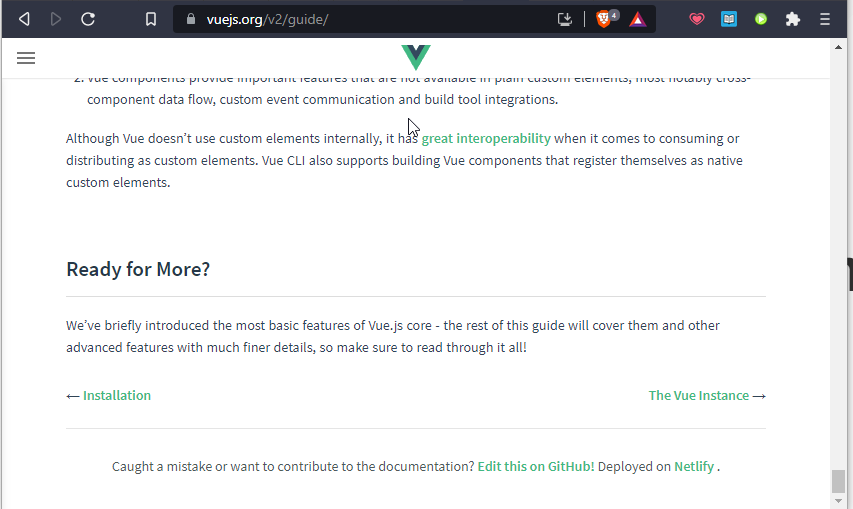

= Living Documentation
:author: Marc Bouvier @marcbouvier_ <m.bouvier.dev@gmail.com>
:date: {localdate}
:revealjsdir: reveal.js
:customcss: css/presentation.css
:source-highlighter: highlightjs
:docinfo: private

[background-image="assets/hoken-landing.png"]
== Tu ne le sais pas encore, mais tu l'as deja documenté !

[.notes]
--
* aaa
* bbb
--

[.columns]
== Qui suis-je ?

[.column]
--
Marc Bouvier
--

[.column]
--
image::assets/marc-bouvier-rnd-25.png[]
--

[%notitle]
== Table of Contents

toc::[]

<<<

[.columns]
== Living Documentation

[.column]
--
* TODO
* TODO
* TODO
--

[.column]
--
image::assets/qrcode_u.baldir.fr_AT2021LD.png[QR Code vers le lien de la présentation : u.baldir.fr/at-2021-ld]
--

[.refs]
--
* link:u.baldir.fr/at-2021-ld[]
* Lien vers cette présentation
--

== La documentation, c'est quoi pour vous ?

+++

    

        <textarea id="what_is_doc_1a" style="font-size: 1rem;height: 16rem;"></textarea>
        

            <button onclick="localStorage.setItem('what_is_doc_1', document.getElementById('what_is_doc_1a').value);generate_what_is_doc_1_cloud()" style="width: 100%;">Save</button>
            <button onclick="document.getElementById('what_is_doc_1a').value = localStorage.getItem('what_is_doc_1')" style="width: 100%;">Load</button>
        

    

+++

[#what_is_doc_1_cloud,%notitle]
=== Word Cloud

== Antipatterns

[quote,Gojko Adzic,Specification by Example: How Successful Teams Deliver the Right Software]
Like cheap wine, paper documentation ages rapidly and leaves you with bad headache.

== Antipatterns take away

=== Activités séparées

TODO trouver GIF

=== Mais au fait, elle fait quoi notre application?

* Manuel utilisateur
* OpenApi / Swagger
* Javadoc
* Site web
* Readme.md
* Demo site = documentation

=== Pour qui ?

=== Pourquoi?

* Onboarding
* Readme
* Contribute
* CodeTour

== !

=== Comment?

* Ecrit?
Non écrit?
* Conversations (ex. pour onboarding)
* Conversations over Documentation
* Travailer ensemble
* Pair programming / Mob programmgin
* Interviews métier, immersion
* Code
* Commentaires -> refactor
* Code = documentation
* nommage : classes, packages, fonctions
* annotations et métadonnées
* DDD
* tests
* TDD
* BDD

== !

== Plain text

=== Markdown

* primitive lightweight syntax
* embed HTML
* Github
    * Repo
    * Pages
* Azure DevOps
    * Wiki as code

=== Markdown pros/cons

Pros

* primitive syntax
* supported everywhere

Cons

* Flavour hell
* not much advanced features
    * embed HTML if

=== Asciidoc

* [Asciidoc](https://asciidoc-py.github.io/)
* [Asciidoctor](https://docs.asciidoctor.org/)
* Github
    * Repo
    * Pages

=== Asciidoc pros/cons

Pros

* Converters
    * Built-in
        * Html
        * XHTML
        * DocBook
        * Man page
    * Add-on
        * PDF
        * EPUB3
        * Reveal.js
        * Bespoke
* Supported in most serious IDEs
* Actionable from code
    * Asciidoclet
    * Maven tools
* much more capabilities out of the box (see https://docs.asciidoctor.org/asciidoc/latest/asciidoc-vs-markdown/[Compare AsciiDoc to Markdown])
  * includes
    * split your .adoc files
    * include code snippets from your real code
  * Links
  * Admonitions
  * Better tables (IMHO)
  * Better quotes
  * anchors
  * collapsible blocks
* extension system
* multiple implementations
  * Asciidoctor (Ruby)
  * AsciidoctorJs (Js) (transpiled from Ruby)
  * AsciidoctorJ (Java)
* migration from markdown
  * [some of markdown syntax is compatible](https://docs.asciidoctor.org/asciidoc/latest/syntax-quick-reference/#markdown-compatibility)

Cons

* much more syntax to learn (but you don't need to learn everything for simple document)
* not supported everywhere yet
    * Azure DevOps

=== Demo CodeTour

* Versionné
* Peut être validé quand le code change
* Json
* Peut servir de base pour d'autres automatisations
* Exemple

== !

== Doctest

Python Elixir

== !

== import in markup

- AsciiDoc
- LateX

La doc s'appuie sur votre code (ex. .env sample)

== !

=== Différentes caractéristiques

* Stable

TODO : tableau

* Statique, immuable, standard
* Dynamique, change souvent

== !

Evergreen document Ce qui est stable = ce qui est toujours vrai

tout ce qui bouge ailleurs

* marketing
* noms de sociétés
* les dates
* les gens

== !

Les comportements métiers

BDD

Documentation exécutable

== !

Redondance

Quelle est la source de vérité?

Cucumber / Specflow -> réconciliation entre scénarios et code

== !

Automatisation : ça tourne mal

+++
Source : <a href="https://www.youtube.com/watch?v=t2X3wlvoShg">I Built a 600 Meter Human Cannon That Ends All Existence - Satisfactory</a> - Let's Game It Out - 2020
+++

== !

== DRY - Aussi pour la documentation

* Single source of source
* Plusieurs cibles de documentation possibles

== !

image:assets/one_source_of_truth_multiple_targets.png[A partir du code source de la classe Intr en Kotlin, la documentation interactive de l'IDE et l'API reference sur un site web sont générées]

== Des nouvelles façons de documenter

== Tests as documentation

=== Elixir Doctest

=== Rust Documentation tests

https://doc.rust-lang.org/rustdoc/documentation-tests.html

=== Java 18 Javadoc Code Snippets

https://openjdk.java.net/jeps/413:[JEP 413 : Code Snippets in Java API Documentation]

https://www.morling.dev/blog/executable-javadoc-code-snippets/

=== !

[source,java]
----
include::exemples/executable-javadoc-code-snippets/src/main/java/fr/baldir/samples/hello/Hello.java[]
----

=== !

[source,java]
----
include::exemples/executable-javadoc-code-snippets/src/test/java/snippets/SnippetTest.java[]
----

=== !

== Contributif

Wiki as code

 
Source : <a href="https://vuejs.org/v2/guide">https://vuejs.org/v2/guide</a>

== Documenter pendant

* TDD
* Documenter l'intention, le comportement

[.colums]
== Conclusion

[.colum]
--
Les slides
--

[.colum]
--
image:assets/qrcode_u.baldir.fr_AT2021LD.png[]]
--

=== La documentation c'est quoi pour vous?

+++

    

        <textarea id="what_is_doc_1b" style="font-size: 1rem;height: 16rem;"></textarea>
        

            <button onclick="localStorage.setItem('what_is_doc_1', document.getElementById('what_is_doc_1b').value)" style="width: 100%;">Save</button>
            <button onclick="document.getElementById('what_is_doc_1b').value = localStorage.getItem('what_is_doc_1')"  style="width: 100%;">Load</button>
        

    

    

        <textarea id="what_is_doc_2" style="font-size: 1rem;height: 16rem;"></textarea>
        

            <button onclick="localStorage.setItem('what_is_doc_2', document.getElementById('what_is_doc_2').value)" style="width: 100%;">Save</button>
            <button onclick="document.getElementById('what_is_doc_2').value = localStorage.getItem('what_is_doc_2')" style="width: 100%;">Load</button>
        

    

+++

== !

== Ressources

* https://zenika.github.io/adoc-presentation-model/reveal/reveal-my-asciidoc.html[Reveal my Asciidoc - a deep dive into presentation as code] - 2020-01-09 - Benoit COUETIL
    * https://github.com/zenika/adoc-presentation-model[AsciiDoctor Presentation Model]

== !

[Living Documentation](https://www.eyrolles.com/Informatique/Livre/living-documentation-9780134689326/) - Cyrille Martraire ([@cyriux](https://twitter.com/cyriux))

== !

 <iframe width="720" height="480" src="https://www.youtube.com/embed/Tw-wcps7WqU" title="YouTube video player" frameborder="0" allow="accelerometer; autoplay; clipboard-write; encrypted-media; gyroscope; picture-in-picture" allowfullscreen></iframe> 

[Living Documentation : vous allez aimer la documentation !(Cyrille Martraire)](https://www.youtube.com/watch?v=Tw-wcps7WqU)

== !

[Gojko Adzic](https://www.goodreads.com/author/show/1407215.Gojko_Adzic) ([@gojkoadzic](https://twitter.com/gojkoadzic=))

== !

[Awesome Living Documentation](https://github.com/LivingDocumentation/awesome-living-documentation)

== !

Gifs

== !

 <iframe src="https://giphy.com/embed/xUOxeZy7TXZYptBMSA" width="480" height="270" frameBorder="0" class="giphy-embed" allowFullScreen></iframe> 
 <a href="https://giphy.com/gifs/brooklynninenine-brooklyn-99-xUOxeZy7TXZYptBMSA"> via GIPHY</a> 
 

== !

<iframe src="https://giphy.com/embed/iUR4qsCkrNHhe" width="480" height="452" frameBorder="0" class="giphy-embed" allowFullScreen></iframe>
<a href="https://giphy.com/gifs/cat-iUR4qsCkrNHhe">via GIPHY</a>

== !

<iframe src="https://giphy.com/embed/HU6hWEApxYTgQ" width="461" height="480" frameBorder="0" class="giphy-embed" allowFullScreen></iframe>
<a href="https://giphy.com/gifs/jim-carrey-HU6hWEApxYTgQ">via GIPHY</a>

== !
